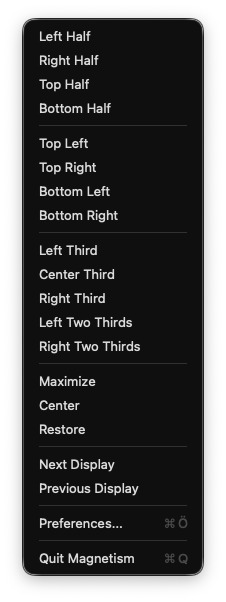
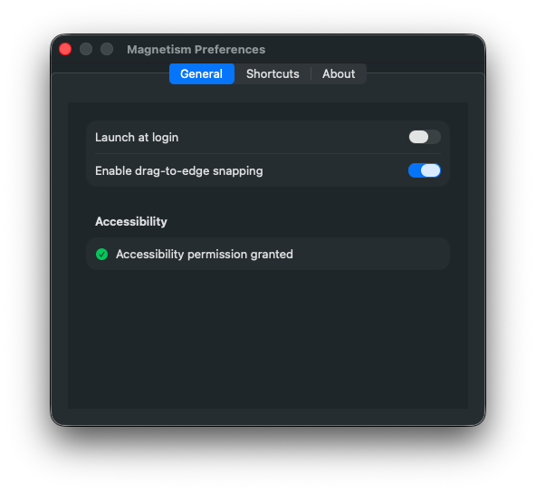
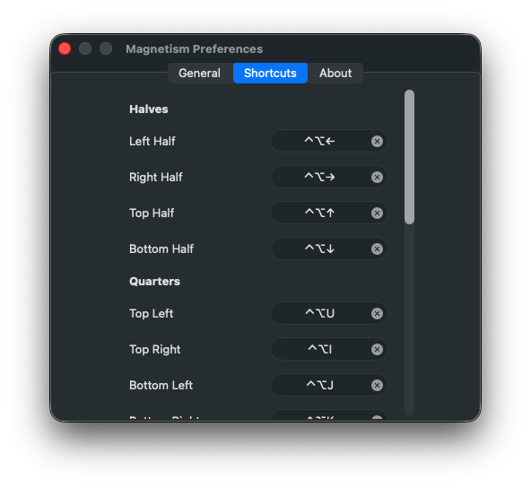

# Magnetism

A free, open-source window manager for macOS. Snap windows to halves, quarters, thirds, and more — using keyboard shortcuts or by dragging to screen edges. A native Swift alternative to [Magnet](https://magnet.crowdcafe.com/).



## Features

- **18 window positions** — halves, quarters, thirds, two-thirds, maximize, center, restore
- **Keyboard shortcuts** — Magnet-compatible defaults, fully customizable
- **Drag-to-edge snapping** — drag a window to any screen edge or corner to snap it
- **Multi-display support** — move windows between displays with shortcuts
- **Smooth animations** — ease-out window transitions
- **Menu bar app** — lives in your menu bar, no dock icon
- **Launch at login** — start automatically when you log in
- **Native Swift** — no Electron, no overhead, just a lightweight native app

## Screenshots

| General Settings | Keyboard Shortcuts |
|---|---|
|  |  |

## Default Shortcuts

| Action | Shortcut |
|---|---|
| Left Half | `⌃⌥←` |
| Right Half | `⌃⌥→` |
| Top Half | `⌃⌥↑` |
| Bottom Half | `⌃⌥↓` |
| Top Left | `⌃⌥U` |
| Top Right | `⌃⌥I` |
| Bottom Left | `⌃⌥J` |
| Bottom Right | `⌃⌥K` |
| Left Third | `⌃⌥D` |
| Center Third | `⌃⌥F` |
| Right Third | `⌃⌥G` |
| Left Two Thirds | `⌃⌥E` |
| Right Two Thirds | `⌃⌥T` |
| Maximize | `⌃⌥Enter` |
| Center | `⌃⌥C` |
| Restore | `⌃⌥Delete` |
| Next Display | `⌃⌥⌘→` |
| Previous Display | `⌃⌥⌘←` |

All shortcuts can be changed in Preferences → Shortcuts.

## Install

### Homebrew (recommended)

```bash
brew install --cask --no-quarantine sadopc/tap/magnetism
```

### Manual Download

1. Download `Magnetism.zip` from the [latest release](https://github.com/sadopc/magnetism/releases/latest)
2. Unzip and drag **Magnetism.app** to your Applications folder
3. Open it — macOS will warn you because the app isn't signed. To open:
   - **Right-click** (or Control-click) the app → **Open** → click **Open** in the dialog
   - Or: System Settings → Privacy & Security → scroll down and click **Open Anyway**
4. Grant **Accessibility** permission when prompted (required to move windows)

### Build from Source

Requires Xcode 16+ and [XcodeGen](https://github.com/yonaskolb/XcodeGen):

```bash
brew install xcodegen
git clone https://github.com/sadopc/magnetism.git
cd magnetism
xcodegen
xcodebuild -scheme Magnetism -configuration Release build
```

The built app will be in `~/Library/Developer/Xcode/DerivedData/Magnetism-*/Build/Products/Release/Magnetism.app`.

## Gatekeeper Notice

The app is **not notarized** (no $99/year Apple Developer account). macOS will block it unless you bypass Gatekeeper:

| Method | How |
|---|---|
| **Homebrew** (recommended) | `brew install --cask --no-quarantine sadopc/tap/magnetism` |
| **Manual download** | Right-click → Open → click Open, or System Settings → Privacy & Security → Open Anyway |
| **Terminal** | `xattr -cr /Applications/Magnetism.app` |

## Requirements

- macOS 14 (Sonoma) or later
- Accessibility permission (prompted on first launch)

## Tech Stack

- Swift 6 (AppKit + SwiftUI)
- [KeyboardShortcuts](https://github.com/sindresorhus/KeyboardShortcuts) by Sindre Sorhus
- No App Sandbox (required for Accessibility API)

## License

MIT
